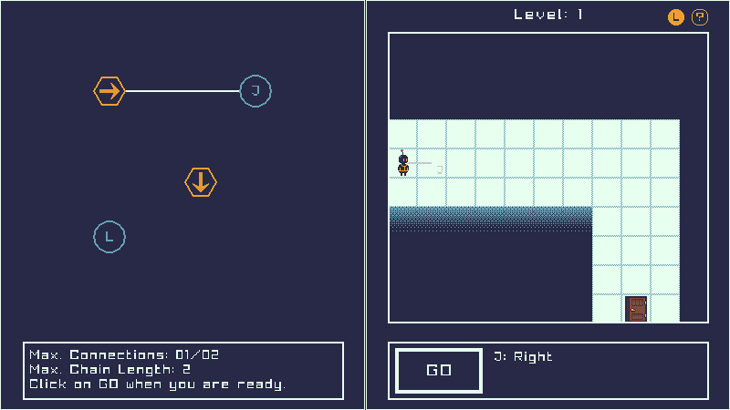
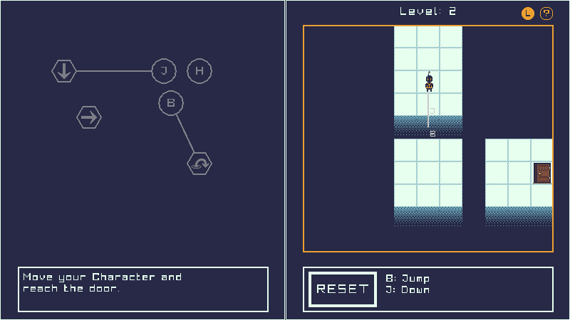

## NeuroCircuit


_Entry for raylib NEXT gamejam, theme: **connections**_

https://furudbat.itch.io/neurocircuit

### Description

**NeuroCircuit** is a puzzle-game, where you need to connect Neurons.

Poor Roby fell of a cliff and got their wiring messed up, 
help them get back home by connecting his key neurons with his action neurons to move to the next levels.

### Features

 - customize your key-binds in a new way
 - chain actions
 - move character with your customized key-binds
   - move (Up, Right, Down, Left)
   - jump in facing direction
 - ~~collect key to open door~~
 - ~~walls and obstetrical in the Neurons section~~
 - 4+ Levels
 - **Rules**
   - [x] Only connect Action with Keys or Action with other Actions
   - [x] Crossing (connection) lines with other lines not allowed
   - [x] Crossing (connection) lines with nodes not allowed
   - [x] Action can only connect with one Key
   - [x] Action can only have one direct connection with one Key
 - show more help in-game
   - L-Button: show Guidelines (on Map)
   - ?-Button: show Help
 - ~~timer and score~~
 - ~~animation, jump animation~~

I didn't finish all the features in time, but at least it works :)

### Controls

#### Keyboard/Mouse:

 - Left click on Neurons to connect
 - Right click on Neurons to disconnect
 - Press enter to quick start the level
 - Press Backspace to quick reset the Level
 - use the connected key-binds to move the character, possible keys:
   - H, J, K, L, B, G

#### How to play

1. link Neurons for key binding
2. press GO when ready
3. move Roby
4. reach door without falling into the void
   1. press RESET to reconnect Neurons

_You jump in the direction you are facing._  
_You can turn on/off guidelines next the "?"_

### Screenshots






### Developers

 - [@furudbat](https://twitter.com/furudbat) - Developer
 - [@blacktiger5](https://twitter.com/blacktiger5_) - Art, Level Design

### Links

 - itch.io Release: https://furudbat.itch.io/neurocircuit

### Build

Made for Desktop and Web.

#### Configure

C++-Compiler (min. C++20) and cmake required.

```bash
cmake -G Ninja -S . -B build
```

#### Configure for Web

emscripten and cmake needed, see [Install emscripten toolchain](https://github.com/raysan5/raylib/wiki/Working-for-Web-(HTML5)#1-install-emscripten-toolchain).

```bash
cmake -DCMAKE_C_COMPILER=emcc -DCMAKE_CXX_COMPILER=em++ -DPLATFORM=Web -DCMAKE_BUILD_TYPE=MinSizeRel -G Ninja -S . -B build-web
```
_(tested on arch linux with [emscripten](https://archlinux.org/packages/extra/x86_64/emscripten/) installed)_

#### Build

```bash
cmake --build build-web --target raylib_game
```

### License

This project sources are licensed under an unmodified zlib/libpng license, which is an OSI-certified, BSD-like license that allows static linking with closed source software. Check [LICENSE](LICENSE) for further details.

*Copyright (c) 2024 furudbat ([@furudbat](https://twitter.com/furudbat))*

#### More Links

- https://bsky.app/profile/blacktiger5.bsky.social
- https://github.com/githubnext/monaspace
- https://itch.io/jam/raylib-next-gamejam

---


## Walkthrough (SPOILERS)

### Level 1

Key-Binds (connect the Neurons likes this):

      J: Right 
      L: Down
Press `GO` and then thous keys:  
**8x`J`, 5x`L`**

### Level 2

      J: Down
      B: Right
      H: Jump
Press `GO` and then thous keys:  
**3x`J`, `H`, `J`, `B`, 2x`H`**

### Level 3

      L: Right -> Up
      H: Down -> Right
Press `GO` and then thous keys:  
**3x`H`, 2x`L`, `H`**

### Level 4

      B: Up
      K: Jump -> Right
Press `GO` and then thous keys:  
**`K`, 2x`B`, 2x`K`, `B`, `K`**

### Level 5

#### Solution 1
      B: Left -> Jump
      G: Up -> Jump
Press `GO` and then thous keys:  
**2x`B`, 2x`G`, `B`**

#### Solution 2
      B: Left -> Down
      G: Up -> Jump
Press `GO` and then thous keys:  
**3x`G`, 3x`B`, `G`, 4x`B`, `G`, 2x`B`**


There are always multiple solutions in this type of games, this is just one way.


**Thanks for playing our game <3**
